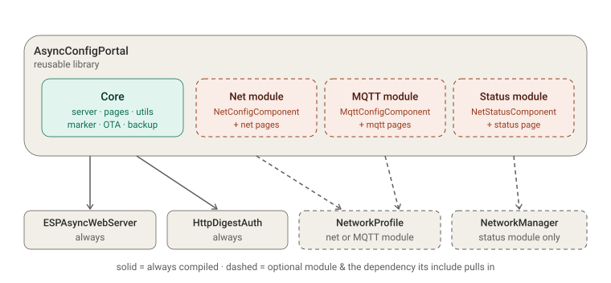

# AsyncConfigPortal — design notes

How the library is put together, why the pieces sit where they do, and the traps
worth knowing before extending it. The README covers what it does and how to use
it; this is the layer underneath. The server began life inside a GPS/NTP project
and was pulled out into a library, which is where the base-vs-application
boundary below comes from.

## Library boundary

The library ships a **core** that is always compiled, plus **optional modules**
that are opt-in and carry no mandatory dependency: including one is what pulls in
the library it needs, and a build that never includes it has none. External
dependencies are therefore split into always-needed and conditional.

|Unit|Placement|Compiled|Depends on|
|---|---|---|---|
|`AsyncConfigPortal` (`.h`/`.cpp`)|core|always|ESPAsyncWebServer, HttpDigestAuth|
|`ConfigWebPages.h` (base pages, save results)|core|header-only|—|
|`WebFormUtils.h` (POST helpers)|core|header-only|ESPAsyncWebServer|
|`JsonReadUtils.h` (restore parsing)|core|header-only|—|
|`FirmwareMarker.h` (OTA identity)|core|header-only|—|
|`NetConfigComponent.h` + `NetConfigPages.h`|net module|only when included|NetworkProfile (conditional)|
|`MqttConfigComponent.h` + `MqttConfigPages.h`|MQTT module|only when included|NetworkProfile (conditional)|
|`NetStatusComponent.h` + `NetStatusPages.h`|status module|only when included|NetworkManager (conditional)|

The MQTT and status modules are separate from the net one rather than folded
into it, because their dependencies differ: editing broker settings needs
`MqttProfile` from the NetworkProfile family, while showing the live link needs
`NetworkManager`. A project that only edits profiles should not acquire the
manager, and one that only reports status should not acquire the profiles.

## Decisions

### 1. `FirmwareMarker` — bundled, validation mandatory

The generic marker scan/compare logic and the `FirmwareMarker` struct live in
the core; OTA upload always scans the incoming image and rejects a wrong
project/board before it can overwrite the running firmware. This is the whole
point of the marker: filtering out mismatched firmware. The identity values
come from per-`[env]` build flags (`FIRMWARE_PROJECT` / `FIRMWARE_BOARD` /
`FIRMWARE_VERSION`); the app references `g_fwMarker` once to keep the linker
from stripping it.

This is an *integrity* guard (right file), not an *authenticity* check — Secure
Boot v2 + signed images is the complementary authenticity layer (final-release
step). A pluggable/optional validation hook is a possible future refinement but
not planned; validation stays mandatory.

### 2. Page assets split

The base pages stay in `ConfigWebPages.h`: the stylesheet and shared scripts,
the header/footer macros, the Status, Other, Backup and Factory-reset pages, and
the shared result pages `CONFIG_PORTAL_SAVED_HTML` and
`CONFIG_PORTAL_SAVE_FAILED_HTML`. Each module's own markup moves next to the
module — `CONFIG_PORTAL_NET_HTML` into `NetConfigPages.h`,
`CONFIG_PORTAL_MQTT_HTML` into `MqttConfigPages.h`,
`CONFIG_PORTAL_NETSTATUS_HTML` into `NetStatusPages.h`, each included by its
component. So a module is one self-contained unit and the base carries no
module-specific markup.

The save results are base rather than module assets because every module answers
a POST with them, and both return to the page the request came from — so a
module serves them as they are and never names its own path.

`CONFIG_PORTAL_HEADER` and `CONFIG_PORTAL_FOOTER` are fragments, not a document
frame: the footer emits the project block and stops, without closing `</body>` or
`</html>`. A page that uses them supplies its own closing tags. That is on
purpose — a page may need to put its own scripts after the footer — but it does
mean a page built by copying half a built-in one can end up unbalanced.

### 3. Shared field builders and where validation lives

The client assets are split by who needs them. `/common.js` is loaded by every
page (menu, project footer, the liveness watchdog); `/fields.js` only by pages
with forms, and it carries the row builders — `ifRow` (text), `numRow` (number),
`selectRow` (dropdown) — plus the validation engine they register into. The split
keeps a read-only page from downloading a form toolkit it will not use.

The builders exist so a project page gets the same markup, the same inline error
placement and the same submit gating as the built-in ones without copying markup.
A page describes its fields; it does not hand-write `<input>` elements.

Validation is deliberately in two places, and they are not redundant. The client
gives immediate feedback and gates the submit button; the firmware re-checks
everything on POST, because the client cannot be trusted and a form is not the
only way to reach an endpoint. Where a rule is structural rather than
per-field —
address inside the subnet, contiguous mask, gateway on-subnet — the client mirror
(`fvCheckStatic`) and the firmware check (`NetworkProfile::checkConfig`) must
agree; the mirror exists to keep the user from submitting something the device
would only reject after a round trip.

### 4. `NetConfigComponent` — optional, opt-in module inside the lib

The component ships **in** the library (batteries included: the app should only
have to implement its own business logic), but as an **opt-in** module that
creates **no mandatory dependency** on the NetworkProfile library. An
application that wants managed network config gets a ready, working one; an
application that doesn't pays nothing; an application that wants its own writes
it against the base composition API.

## How the optional module stays dependency-free

Three things together make the NetworkProfile dependency non-mandatory:

1. `NetConfigComponent` is **header-only** — the compiler never touches it, and
   its `#include "NetworkProfile.h"` is never reached, unless a translation unit
   includes the component.
2. `library.json` declares as hard dependencies **only** `ESPAsyncWebServer` and
   `HttpDigestAuth` — **not** NetworkProfile.
3. To use the ready net page, the application adds `#include
   "NetConfigComponent.h"` and puts the NetworkProfile library in **its own**
   `lib_deps`; `NetworkProfile.h` resolves from there.

Opt out → don't include it → zero coupling. Custom → implement your own via
`addPage()` / `addJsonEndpoint()` / `addPostHandler()`.

## Constraints that keep the pattern working  ⚠️

These are load-bearing — breaking either reintroduces a mandatory dependency:

- **Keep `NetConfigComponent` header-only.** Arduino/PlatformIO compiles every
  `.cpp` in a library's `src/` unconditionally. If the component ever needs a
  `.cpp`, guard the whole translation unit behind a macro
  (e.g. `#if defined(NET_CONFIG_ENABLED)`) that the app defines to opt in.
- **`lib_ldf_mode = chain` (the PlatformIO default) is required.** `deep` /
  `deep+` scan *all* library headers regardless of includes and would try to
  resolve `NetworkProfile.h` even when the net module is unused, breaking the
  optionality.

## Running on ESP8266

The library is dual-platform. Most of it is portable as written; these are the
places where it is not, and the reasoning is worth keeping, because each one was
found by a crash rather than by reading the code.

**Program space is a separate address space.** On ESP8266 (and AVR) a `PROGMEM`
string cannot be read by a RAM function: byte-wise access to flash faults with
`LoadStoreError` (exception 3). Every page and asset in `ConfigWebPages.h` lives
in flash, so they are served through `sendProgmem()`, which streams them with
`memcpy_P()`. Format strings go through `snprintf_P()`. On ESP32 flash is
memory-mapped and all of this is a no-op, so the same call sites work unchanged.
The trap is that a plain `send()` looks correct and works on ESP32.

**Do not buffer a page to send it.** The first fix for the above — building the
response in an `AsyncResponseStream` — copies the whole page into RAM. Four
assets loading in parallel exhausted a healthy 28 KB heap and the device died of
OOM. Streaming from flash costs only the TCP chunk, so `sendProgmem()` never
holds more than that.

**The same applies to large JSON.** `req->send(code, type, body)` takes a
`const String&`, so a `char*` body is copied into a String — for the ~9 KB
`/netdata` document, an allocation that a fragmented heap will refuse. The
streaming `addJsonEndpoint()` overload hands the buffer to the response instead,
which is why the source keeps the buffer claimed and the framework releases it
when the send completes.

**The stack is about 4 KB.** A KB-sized local buffer is fine on ESP32 and
corrupts memory here: one `NetworkProfile::JSON_SIZE` (1.2 KB) local inside a
loop was enough. Buffers of that size are static, protected by the same
single-task claim as the shared ones.

**No FreeRTOS.** `_scheduleRestart()` cannot start a task, so ESP8266 uses a
one-shot `Ticker`. The deferred restart matters on both platforms: restarting
inside a handler tears down the connection before the response is flushed.

**OTA differs.** `Update.runAsync(true)` is required before `begin()` when the
upload is driven by an async server, and there is no `abort()`: since `begin()`
is sized to the whole free sketch space the image is never "finished", so
`end(false)` resets it without activating anything.

**Atomics are not free.** The LX106 has no atomic read-modify-write instruction,
so `std::atomic<uint32_t>::fetch_add()` compiles to a `libatomic` call the core
does not link — a link error, not a compile error. It is also unnecessary: async
callbacks run in the SYS context, which only runs once the loop task yields, so
there is no preemption to guard against. `examples/CustomPage` shows the pattern.

## Packaging

Both manifests ship: `library.json` (PlatformIO) and `library.properties`
(Arduino Library Manager). The hard dependencies are `ESPAsyncWebServer` and
`HttpDigestAuth`; the async TCP layer underneath is platform-conditional
(`AsyncTCP` on ESP32, `ESPAsyncTCP` on ESP8266), which is why the ESP32 entry is
scoped to `espressif32` in `library.json`. `NetworkProfile` is deliberately *not*
a dependency — see the opt-in module above.

## Logging

The log hook carries a level and a subsystem tag:
`enum class LogLevel { Error, Warn, Info, Debug }` and
`LogFn = std::function<void(LogLevel, const char* tag, const char* msg)>`.
Silent by default; the app binds `setLogger()`, maps the level to
`ESP_LOGE/W/I/D` and passes the tag through as the ESP log tag (ESP_LOGx accepts
a runtime tag), so output stays filterable per subsystem rather than collapsing
into a single label for the whole server.

## Config lifecycle: backup, restore, factory reset

These are composition hooks, not built-in features: the server owns the page and
the plumbing, the components own their data.

**Backup is per component, not one aggregated document.** A component registers
one section with `addBackupSection(title, downloadPath, restorePath, fieldsJson)`
and serves those two routes itself, through the ordinary composition API. The
Backup page — and its menu entry — comes into existence with the first section,
so a device whose whole configuration is two checkboxes does not carry a Backup
item it has no use for. Both paths are taken in one call on purpose: a component
offering a download but no upload (or the reverse) is a trap for the user, and
separate registration calls would make that state reachable.

An earlier design had the server aggregate registered providers into a single
`{"<key>": <json>, ...}` document and dispatch fragments back on restore. It was
dropped: the server would have had to understand the document, every component
would have had to agree on the envelope, and a partially applied restore becomes
possible the moment one fragment validates and another does not. Per-component
files keep validation and application in the one place that understands the data.

**Restore validates the whole document before writing anything.** A mangled file
therefore changes nothing at all, rather than applying the half it could read.
That needs *reading* JSON, not just writing it, so the library carries
`JsonReadUtils.h`: a small, allocation-free reader over a `JsonSpan` view
(`jsonRoot`, `jsonValidate`, `jsonMember`, `jsonVal`, `jsonNum`, `jsonIp`) rather
than a JSON library. It is enough for documents this shape, keeps the dependency
list unchanged, and never allocates — which is what makes it usable inside an
async handler on a small heap.

**Factory reset is a registry of named targets.** `addResetHandler(what, fn)`
adds one; the built-in route runs them all, reports how many failed, and
restarts. `what` is the human-readable name that appears in the log line, so a
failure says which store could not be erased. With no handler registered the
button still appears and clears what the server itself owns (the credentials) —
it never silently does nothing, but it also never guesses at application state.

## Detecting a lost device

A page that simply stops receiving updates looks identical to a working one: the
last values stay on screen, and on the GPS/NTP page the clock even keeps ticking.
Nothing in the markup says "this is history". Two mechanisms cover this, because
the pages fall into two shapes.

**Liveness is "the device answered", not "the answer was 200".** This distinction
is load-bearing. `/chkauth` returns 401 on a page the user is not logged in for,
and a JSON endpoint can return 500 while the device is perfectly healthy — both
prove the device is *there*. Judging liveness by status 200 would raise a false
alarm in both cases. In XHR terms: `status === 0` at `readyState 4` means the
request reached nobody; any status code at all means it did.

One miss is tolerated. Two consecutive failures raise the banner, so a reboot or
a single dropped request does not make it flash.

|Page shape|How loss is detected|
|---|---|
|Polls for data (Status, GPS/NTP)|its own polls feed the watchdog through `getJSON()`|
|Form, fetched once (Network, Other)|the `/chkauth` heartbeat, every 10 s|

The heartbeat runs from `initCommon()` on every page, so a page author never has
to think about which category theirs is; on polling pages it is merely redundant.
`/chkauth` was chosen because it is tiny, exists everywhere, and already had to
be called to decide whether to show the Logout link — its status code answers the
auth question while merely *having* a status code answers the liveness question,
so one request serves both.

**Why the form pages need it at all.** They fetch `/netdata` once and then sit
idle, so without a heartbeat a device that died mid-edit would go unnoticed until
the user pressed Save — and since the form is a plain `<form method="post">`, the
browser navigates away on submit and shows its own error page, taking the typed
values with it. The heartbeat moves that discovery to *before* the user invests
the effort.

**Submit is disabled while offline.** This is what actually protects the user's
work, and it is simpler than the XHR-submit rewrite first considered: the form is
a plain POST, so pressing Save against a dead device makes the browser navigate
away to its own error page, taking everything typed with it. With the button
disabled there is nothing to lose — the input stays on the page until the device
answers again, at which point the button re-enables on its own.

Two details make it hold:

- `validateForm()` treats offline as overriding validity (`disabled = !ok||
  netDown`), otherwise the next keystroke would re-enable a button the watchdog
  had just disabled.
- `netGateSubmits()` disables *every* submit control on the page, not only the
  one wired to the validation engine, then re-runs the last validation so
  validated forms return to their own correct state rather than being blanket
  re-enabled.

**Banner wording is overridable.** The default is deliberately neutral — "Device
not responding" — because it is the one statement true on every page. What
follows from it is not: a status page is showing stale readings, a form page
cannot save. Pages that want to say so set `netOfflineMsg` before
`initCommon()`; the network page does. On status pages the dimming already
conveys staleness, so the neutral text suffices there.

**What the user sees.** A red banner is added at the top of the body, and
`body.stale` dims the values. The dimming matters: a banner alone is easy to scan
past, whereas greyed-out readings make staleness obvious at a glance while
keeping the last known state legible. Pages with their own animation must opt in
to stopping — the GPS/NTP clock checks `netIsDown()` in its tick, otherwise it
would keep counting behind a dead device.
